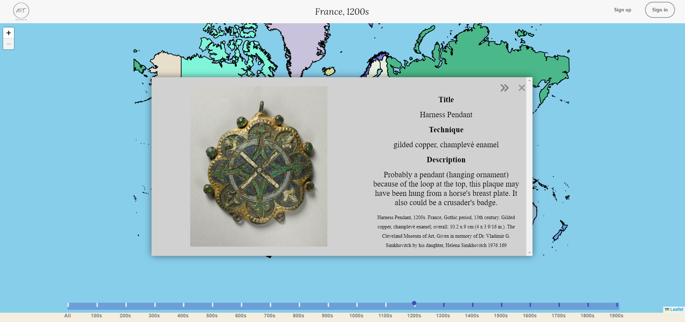
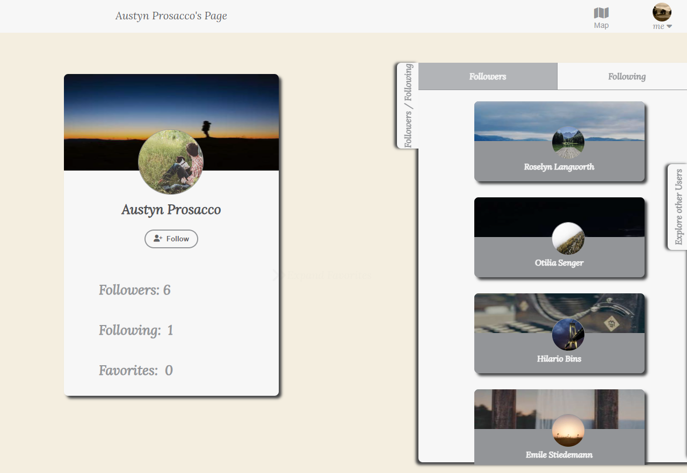
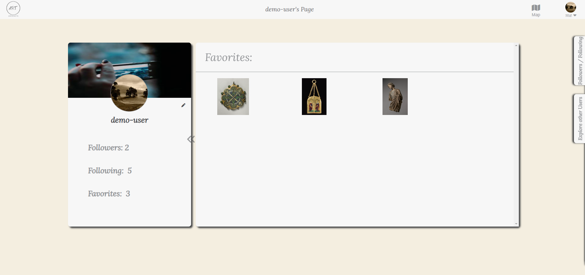

# ARTifacts  
###  [Live Link](https://artifacts-rp87.onrender.com/)

 

### Created by
- Alex Lecky (Team Lead)
- Steven Notovitz (Backend)
- Kevin Chan (Front End)
- Michael Gastello (Flex Dev)

## What is ARTifacts?  

A MERN stack web application that offers a unique way for users to explore artwork from throughout history. By interacting with an interactive 2D world map and timeline slider, users can discover and appreciate a wide range of art. The app also allows users to save their favorite works and create custom collections, which can be showcased on their profile page.

## Built with
- Javasript
- React
- Redux
- Leaflet-React (Map)
- NodeJS
- MongoDB (Database)
- Express
- HTML5
- CSS

# MVPS

## Map & Slider
We decided to use Leaflet to create our map. We found this library very beginner friendly and easy to navigate. This was crucial because of the time alotted for this feature. The countries are being rendered with a customized GeoJSON file.  

A user is able to click on any country of the map and slide the timeline to specific century. Then the fetch is made and the artwork is shown.


```
<MapContainer
        zoom={2.25}
        center={[45, 0]}
        minZoom={2.25}
        maxBounds={maxBounds}
        maxBoundsViscosity={1}
        className="our-map"
       >
        <GeoJSON
          data={countries.features}
          style={geoJsonStyle}
          onEachFeature={onEachCountry}
        />
</MapContainer>
```

## Art Display
In our current version, the art display incldues the artwork and some information about it. This we deem crucial as it gives the artwork more context and value. A user can then favorite that art piece or go on to the next one.  



```
function DisplayArtwork({ artwork, setShowArt }) {

  function handleClick() {
    setShowArt(false);
  }

  return (
    <div className="art-display-container">
      
      <div className="art-info">
        <h1>Title</h1>
        <h2>{artwork.title}</h2>
        <h1>Technique</h1>
        <h2>{artwork.technique}</h2>
        <h1>Description</h1>
        <h2>{artwork.wall_description}</h2>
        <h3>{artwork.tombstone}</h3>
      </div>
      <div className="art-display-buttons">
          <button onClick={() => setShowArt(false)} className="close-form close-display">
            <i className="fa-solid fa-xmark"></i>
          </button>
          <FavoriteButton artwork={artwork} />
      </div>
    </div>
  );
}

export default DisplayArtwork;
```


## User Profile
A big component behind our concept was the idea of allowing a user to have a page where they can display their favorited artwork, not only for themselves but for others. On ARTifacts, users are able to follow one another, creating a more robust user base as all can become connected.  




## Favorites
We took much enjoyment in allowing a user to favorite their artwork and store it on their profile for all to see. Because of the randomness of the art, it creates a 'treasure hunt' effect.  



## Conclusion
This project was so fun to work on. Everyone on our team brought a unique skill or talent to the table. We faced challenges, many pertaining to bugs in the map feature, but ultimately we prevailed. We all look forward to taking on bigger projects and expanding our knowledge of coding. Thank you for your time.

  

From left to right  
Alex Lecky(Team Lead), Michael Gastello(Flex Dev), Kevin Chan(Frontend), Steven Notovitz(Backend)
